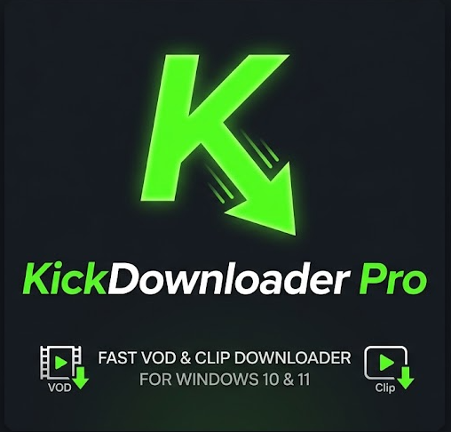



  

# 🟢 KickDownloader Pro

KickDownloader Pro, Kick.com üzerindeki canlı yayın tekrarlarını (VOD) ve klipleri (Clip) kolay, hızlı ve istediğiniz kalite/zaman aralığında indirmenizi sağlayan modern bir Windows masaüstü uygulamasıdır. 

## ✨ Özellikler

- **Tek Tıkla Çalışır (Portable):** Ekstra kurulum gerektirmez. Uygulama ilk açıldığında ihtiyaç duyduğu araçları (yt-dlp, ffmpeg) arka planda otomatik indirir!
- **Hızlı ve Kolay İndirme:** Klipleri ve yayın tekrarlarını orijinal kalitede, kayıpsız olarak direkt .mp4 şeklinde indirme.
- **Zaman Ayarlı Kırpma:** Koca bir yayını indirmek yerine, sadece istediğiniz belirli bir zaman aralığını (Örn: 00:15:30 - 01:25:00) seçerek indirebilme imkanı.
- **Kalite Seçimi:** Kaynak videonun sunduğu "En İyi", 1080p, 720p gibi çeşitli kalite seçeneklerini algılar ve seçiminize sunar.
- **Otomatik Pano Algılama (Auto-Paste):** Kopyaladığınız Kick linkini, uygulamanın bağlantı kutusuna tıkladığınız an otomatik olarak yapıştırır.
- **Geçmiş Sistemi (History):** İndirdiğiniz içeriklerin tarihini, linkini ve başlık bilgisini ayrı bir "İndirme Geçmişi" sekmesinde özenle listeler.
- **Modern ve Karanlık Tema (Dark Mode):** Şık, göz yormayan, oyuncu dostu (Gamer) karanlık arayüz deneyimi.
- **Araç Güncelleyici:** Tek tıkla uygulama içerisinden (arka planda) yt-dlp güncellemesi yapabilme.

---

## 💡 Kullanım Önerisi

Program bağımsız (portable) olarak çalışır ve gereksinim duyduğu \fmpeg.exe\ ve \yt-dlp.exe\ araçlarını ilk çalıştırıldığında kendi yanına indirir. Masaüstünüzün kirlenmemesi için, **EXE dosyasını boş bir klasörün içine koyarak (örneğin "KickDownloader") kullanmanız şiddetle önerilir.**

---

## 🛠️ Gereksinimler

- **İşletim Sistemi:** Windows 10 veya Windows 11
- **Çalışma Zamanı:** (Eğer self-contained exe kullanmıyorsanız) [.NET 8.0 Desktop Runtime](https://dotnet.microsoft.com/en-us/download/dotnet/8.0)

## 🚀 Kurulum & Çalıştırma

1. Releases kısmından en güncel .zip dosyasını indirin. (Eğer Self-Contained versiyonu indirdiyseniz bilgisayarınızda .NET yüklü olmasına bile gerek yoktur.)
2. Programı bir klasöre çıkartın ve çalıştırın. Uygulama, video indirme işlemleri için gereken **ffmpeg.exe** ve **yt-dlp.exe** araçlarını ilk açılışta kendisi indirim sizin için hazır hale getirecektir. İndirme durumu alt kısımdaki bilgi çubuğunda gösterilir.
3. Araçlar indikten sonra videoları indirmeye başlayabilirsiniz!

---

## 📞 İletişim

- **GitHub:** [TRcloud/KickVOD](https://github.com/TRcloud/KickVOD)
- **Discord Davet:** [Kanalımıza Katılın](https://discord.gg/eEwShe3dqf)
- **Kişisel Discord İletişim:** \cloud.are\

## 📄 Lisans
© ® Vibe Coding
